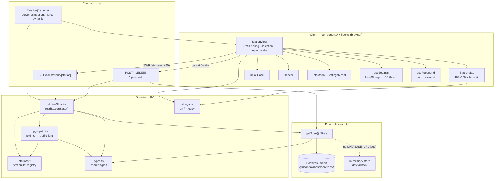
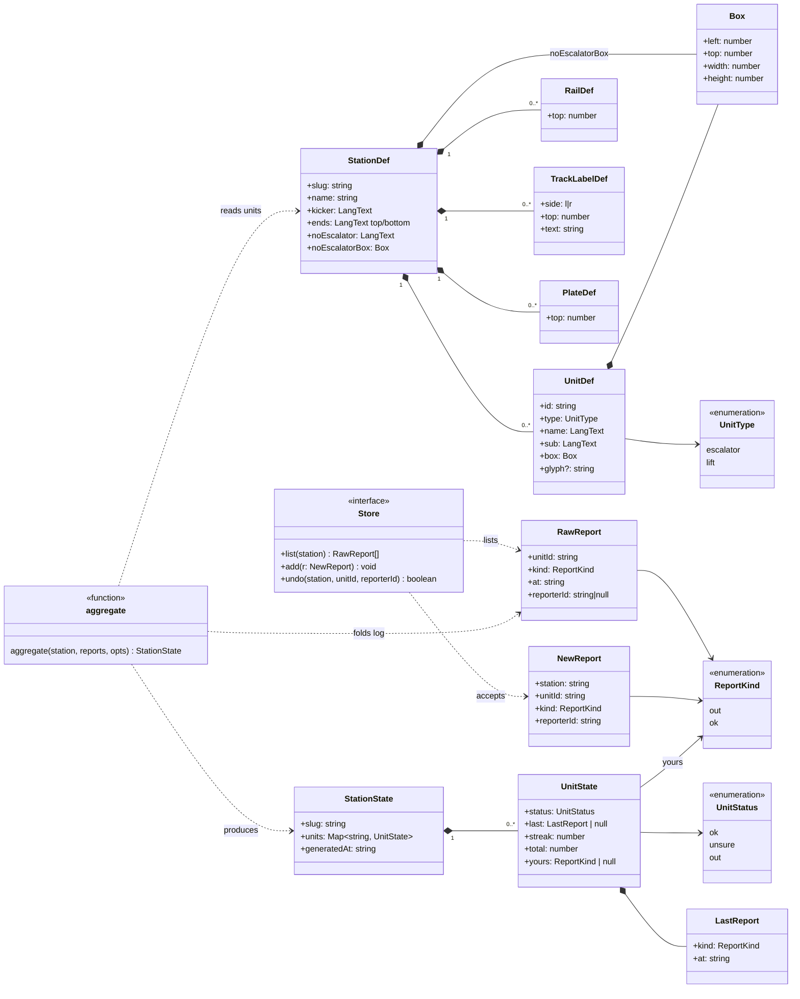

# Architecture

How the pieces fit together. For the per-file responsibility table see
[`.github/agents/roltrapstuk.md`](../.github/agents/roltrapstuk.md); for adding a
station see [`.github/skills/add-station.md`](../.github/skills/add-station.md).
The `/api` endpoints have their own reference in [api.md](api.md); the reasoning
behind the model, the driver and the map lives in [decisions/](decisions/).

roltrapstuk is a Next.js 16 App Router app. The data model is an **append-only
report log** folded into a **three-state traffic light** per unit. There are no
accounts — a browser-local anonymous id is the only notion of "who".

## Component view

**Read path.** `page.tsx` is a `force-dynamic` server component. It calls
`readStationState()`, which loads the station's `StationDef` from the registry,
pulls every report for the slug from the `Store`, and hands both to `aggregate()`
to get a `StationState`. That state is passed to `StationView` as
`initialState` so the first paint is server-rendered. From then on `StationView`
polls `GET /api/stations/[station]` through SWR (every 20 s and on focus), which
runs the same `readStationState()`.

**Write path.** A tap on a report button in `DetailPanel` calls back up to
`StationView`, which `POST`s to `/api/reports`. The handler validates the body,
rejects a second active report from the same device (`409` while the reporter's
previous report is still inside the undo window), appends via `Store.add()`, and
returns the freshly aggregated `StationState` — SWR adopts it without a refetch.
`DELETE /api/reports` is the undo: `Store.undo()` removes the caller's most recent
report for the unit if it is still within `UNDO_WINDOW_MS` (15 minutes).

**Store selection.** `getStore()` returns the Postgres-backed store when
`DATABASE_URL` (or `POSTGRES_URL`) is set, otherwise the in-memory store — which
is refused in production. The `reports` table self-creates on first query.

**Client-only state.** `useReporterId` mints and persists an anonymous id in
`localStorage`; it is sent with every report and as `?r=` on the poll so
`aggregate()` can derive `yours`. `useSettings` holds language, theme preference
and map flip, applied pre-hydration by the inline script in `app/layout.tsx`.

## Data model

`LangText` above is shorthand for `Record<Lang, string>` — every user-facing
string is `{ en, nl }`. `Box` and the `*Def` geometry types are pixel coordinates
against the fixed 402×620 `StationMap` canvas.

### The fold

`aggregate()` is the heart of the model and is pure — same inputs, same output.
Per unit, in chronological order:

- **status** — a confidence counter starts at `+1` (working) and each report
  clamps it one step in `[-1, +1]`: `ok` → `+1`, `out` → `-1`, `0` → `unsure`.
  So one "broken" report only makes a working unit `unsure`; a second settles it
  to `out`. One report the other way cancels an `unsure`. A unit with no reports
  is `ok`.
- **streak** — how many of the most-recent reports share the latest kind.
- **total** — every report ever filed for the unit.
- **yours** — the calling device's own most recent report, but only while it is
  still inside `UNDO_WINDOW_MS`. Once the window passes it drops to `null` and the
  device may report again. While set, the UI hides the report buttons and offers
  only undo.

`RawReport` / `NewReport` are the only shapes that touch the database;
`UnitState` / `StationState` are what the API returns and the client renders.
